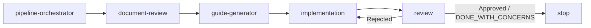

# android-subagent-skill

<p align="center">
  <strong>Markdown-driven Android sub-agent workflow for PRD → guides → implementation → review</strong>
</p>

<p align="center">
  
  
  
</p>

`android-subagent-skill` is a lightweight agent workflow base for Android projects.
It defines how specialized agents share context, hand off work, loop on review, and validate the pipeline with a minimal local harness.

## Why this exists

Most agent workflows break when the next agent cannot reconstruct context.
This repository fixes that by making the contract explicit:

- every stage writes a canonical handoff manifest
- all agents append to a shared `session-context.md`
- one orchestrator controls start timing and review loops
- validation mode proves the skill chain works before using it on a real project

## What you get

- `pipeline-orchestrator-agent` as the single entry point
- four worker skills:
  - `document-reviewer-agent`
  - `code-quality-guide-generator`
  - `implementation-agent`
  - `review-agent`
- a shared session contract in [`agent-session-contract.md`](./agent-session-contract.md)
- a minimal Python harness for fixture validation in [`harness/`](./harness)
- a runnable Android fixture project in [`test-folder/`](./test-folder)

## Pipeline at a glance



Core loop rules:

- standard order is `pipeline-orchestrator -> document-review -> guide-generator -> implementation -> review`
- `Rejected` returns control to `implementation`
- orchestrator allows up to 3 automatic review loops
- `skill-pipeline-validation` does not fail only because the full PRD is not implemented

## Operating modes

| Mode | Purpose | Review behavior |
| --- | --- | --- |
| `project-delivery` | Build the actual product from PRD/TRD | Reviews against product completeness and quality expectations |
| `skill-pipeline-validation` | Validate the agent chain, handoff quality, and representative evidence | Reviews contract integrity, session continuity, and proof of execution |

## Repository layout

```text
.
├── README.md
├── adr.md
├── code-convention.md
├── agent-session-contract.md
├── skills/
│   ├── pipeline-orchestrator-agent/
│   ├── document-reviewer-agent/
│   ├── code-quality-guide-generator/
│   ├── implementation-agent/
│   └── review-agent/
├── harness/
│   ├── agent_registry.py
│   ├── manifest_parser.py
│   ├── validation.py
│   ├── run_validation.py
│   └── tests/
└── test-folder/
    ├── docs/
    ├── app/
    └── gradle/
```

## Session and handoff contract

All parser-facing keys are canonical `snake_case`.
The shared contract lives in [`agent-session-contract.md`](./agent-session-contract.md).

Standard generated files:

- `docs/generated/orchestrator-handoff.md`
- `docs/generated/session-context.md`
- `docs/generated/document-reviewer-handoff.md`
- `docs/generated/guide-generator-handoff.md`
- `docs/generated/handoff-manifest.md`
- `docs/generated/review-handoff-manifest.md`

The important design choice is simple:

- agents do not rely on chat history
- agents rely on durable markdown artifacts

## Quick start

### 1. Prepare project docs

Create:

- `docs/PRD.md`
- `docs/TRD.md`

Optional:

- `docs/generated/context-snapshot.md`

### 2. Start from the orchestrator

The workflow always starts from [`skills/pipeline-orchestrator-agent/SKILL.md`](./skills/pipeline-orchestrator-agent/SKILL.md).

It decides:

- whether this is a fresh run or a resumed run
- which worker should run next
- whether the review loop should continue

### 3. Run validation against the fixture

```bash
python3 -m unittest discover -s harness/tests -v
python3 -m harness.run_validation --project test-folder
```

Expected result:

```text
validation=ok
```

## Validation fixture

[`test-folder/`](./test-folder) is the reference fixture used to prove the skills work together.
It contains:

- a sample Android recommendation app scaffold
- PRD/TRD inputs
- generated handoff and session documents
- review output for `skill-pipeline-validation`

Representative evidence checked in the fixture:

- `./gradlew testDebugUnitTest`
- `./gradlew assembleDebug`

## Skill roles

| Agent | Responsibility | Output |
| --- | --- | --- |
| `pipeline-orchestrator-agent` | start, dispatch, loop control | `orchestrator-handoff.md` |
| `document-reviewer-agent` | normalize PRD/TRD and bootstrap context | `document-reviewer-handoff.md` |
| `code-quality-guide-generator` | produce design intent and quality guide | `guide-generator-handoff.md` |
| `implementation-agent` | implement representative scope and record evidence | `handoff-manifest.md` |
| `review-agent` | classify issues and decide approve / concerns / reject | `review-handoff-manifest.md` |

## Minimal harness

The harness is intentionally small.
It is not a full agent runtime.

Current scope:

- parse canonical markdown manifests
- load session context
- validate worker sequence
- validate fixture outputs
- return a deterministic pass/fail result

Current non-goals:

- live LLM orchestration
- parallel execution
- deployment automation
- generalized workflow engine

## Recommended adoption path

1. Use `test-folder` to validate the pipeline contract.
2. Copy the doc structure into a real Android project.
3. Start all runs from the orchestrator.
4. Keep generated handoffs in `docs/generated/`.
5. Add stricter delivery rules only after validation mode is stable.

## Current status

- orchestrator-based workflow: implemented
- canonical manifest keys: implemented
- validation harness: implemented
- Android fixture: implemented
- real runtime agent executor: not included

## License

No license file is currently included in this repository.
